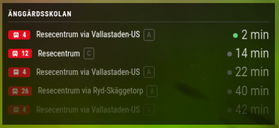
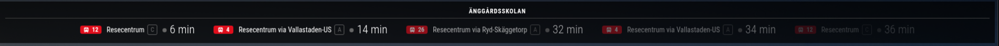

# MMM-Trafiklab

A [MagicMirror²](https://magicmirror.builders/) module that shows upcoming bus/tram/train arrivals and/or departures for a stop in Sweden, using the [Trafiklab Realtime API](https://www.trafiklab.se/api/our-apis/trafiklab-realtime-apis). Layout inspired by [MMM-Futar](https://github.com/balassy/MMM-Futar).

Choose arrivals, departures, or both (two sections in one panel) with the `type` option. Each row shows the line (with a mode icon, colored by transport mode), the direction, the platform letter, the minutes until arrival, and — when the vehicle is off schedule — the timetable time and the delay (`+2` late, `−1` early). Canceled trips are struck through.

## Screenshots

Vertical layout (side columns):



Horizontal layout (`top_bar` / `bottom_bar`):



## Install

```bash
cd ~/MagicMirror/modules
git clone https://github.com/damithsj/MMM-Trafiklab.git
```

No `npm install` is needed (uses Node's built-in `fetch`, Node 18+).

## Getting an API key

1. Create a free account at the [Trafiklab developer portal](https://developer.trafiklab.se/).
2. Create a project and add the **Trafiklab Realtime APIs** to it.
3. Generate an API key for the project and copy it into `apiKey` in your module config.

Trafiklab's Bronze level allows 25 requests per minute and 100,000 requests per 30 days. Keep that in mind when choosing `updateInterval` and `type` (see [Request volume](#request-volume)). The portal's steps may change over time; see the [Trafiklab documentation](https://www.trafiklab.se/api/our-apis/trafiklab-realtime-apis) for the current process.

## Finding your stop id

Use the Stop Lookup endpoint to search for a stop by name:

```
https://realtime-api.trafiklab.se/v1/stops/name/{searchValue}?key=YOUR_API_KEY
```

Example for `Bygdegatan`:

```json
{
  "stop_groups": [
    {
      "id": "740056501",
      "name": "Bygdegatan",
      "transport_modes": ["BUS"],
      "stops": [{ "id": "16629", "name": "Bygdegatan" }]
    }
  ]
}
```

- Use the **stop group `id`** (`740056501`) as `stopId`.
- For `destinationId`, use the short **`stops[].id`** of the destination stop instead (for example `9` for Linköping Centralstation, which belongs to group `740000009`). This is the id the arrivals and departures data reports for a route's final destination.

Results are sorted by traffic, so the busiest matching stops come first. Remember to URL-encode special characters such as `ö` (`Link%C3%B6ping`).

## Configuration

```js
{
  module: "MMM-Trafiklab",
  position: "top_right",
  config: {
    apiKey: "YOUR_API_KEY",   // required
    stopId: "740056501",      // required
    destinationId: "9"        // optional
  }
}
```

Show both arrivals and departures in a bottom bar:

```js
{
  module: "MMM-Trafiklab",
  position: "bottom_bar",
  config: {
    apiKey: "YOUR_API_KEY",
    stopId: "740056501",
    type: "both",
    layout: "horizontal"
  }
}
```

| Option | Default | Description |
|---|---|---|
| `apiKey` | – | **Required.** Trafiklab API key. |
| `stopId` | – | **Required.** Stop id to show arrivals/departures for. |
| `destinationId` | `""` | Optional. If set, only entries whose final destination stop id matches are shown (i.e. one direction of travel). |
| `layout` | `"vertical"` | `"vertical"` for side columns; `"horizontal"` lays the entries out in a wrapping row, for `top_bar` / `bottom_bar`. |
| `platforms` | `[]` | Optional. Only show entries on these scheduled platforms, as an array (`["A", "B"]`) or comma-separated string (`"A,B"`). Case-insensitive. Combines with `destinationId`. |
| `type` | `"arrivals"` | `"arrivals"`, `"departures"` or `"both"`. With `"both"` the module shows an Arrivals and a Departures section (stacked, or side by side with `layout: "horizontal"`) and makes two API calls per update, so mind your key's quota. At mid-route stops the two lists are nearly identical; `"both"` is most useful at terminals and stops where vehicles wait. |
| `maxEntries` | `5` | Number of rows shown, per section when `type` is `"both"`. |
| `updateInterval` | `300000` | How often the API is called (ms, minimum 30000). See [Request volume](#request-volume). |
| `refreshInterval` | `30000` | How often the countdown is redrawn from cached data (ms). |
| `showHeader` | `true` | Show the stop name. |
| `showPlatform` | `true` | Show the platform/stop position. |
| `showDelay` | `true` | Show the delay in minutes. |
| `showRealtimeDot` | `true` | Dot before the countdown: green = live vehicle data, gray = timetable only (no live data, so the delay is unknown). |
| `showScheduled` | `true` | Show the timetable time when it differs from the real-time estimate. |
| `showAlerts` | `true` | Show stop alerts, if any. |
| `coloredLines` | `true` | Color the line badge by transport mode. |
| `showIcons` | `true` | Show a Font Awesome icon (bus, tram, metro, train, ship) in the line badge. |
| `modeIcons` | see source | Font Awesome class per transport mode. |
| `showTimeAfterMinutes` | `60` | Show a clock time instead of a countdown beyond this many minutes. |
| `fade` / `fadePoint` | `true` / `0.25` | Fade out the lower rows. |
| `modeColors` | see [Line colors](#line-colors) | Badge color per transport mode. Override only the modes you want; the rest keep their defaults. |

The module is translated to English and Swedish following the MagicMirror `language` setting.

### Request volume

Each update makes one API request (two with `type: "both"`). The countdown redraws every `refreshInterval` without calling the API.

| `updateInterval` | `type` single | `type: "both"` |
|---|---|---|
| 5 minutes (default) | ~8,600 per 30 days | ~17,300 per 30 days |
| 1 minute | ~43,200 per 30 days | ~86,400 per 30 days |
| 30 seconds (minimum) | ~86,400 per 30 days | ~172,800 per 30 days (over Bronze) |

Restarts, reloads and extra module instances using the same key add to these numbers.

### Line colors

These are the default badge colors. You can change any of them with `modeColors`, and any mode you leave out keeps its default.

| Mode | Default | Color |
|---|---|---|
| `BUS` | `#e10e1c` |  |
| `TRAM` | `#b90000` |  |
| `METRO` | `#0a78c8` |  |
| `TRAIN` | `#ec6fa6` |  |
| `SHIP` | `#00a3a1` |  |
| `TAXI` | `#d4a017` |  |
| `UNKNOWN` | `#808080` |  |

```js
modeColors: {
  BUS: "#e10e1c",
  TRAM: "#b90000",
  METRO: "#0a78c8",
  TRAIN: "#ec6fa6",
  SHIP: "#00a3a1",
  TAXI: "#d4a017",
  UNKNOWN: "#808080"
}
```

## License

[MIT](LICENSE)
